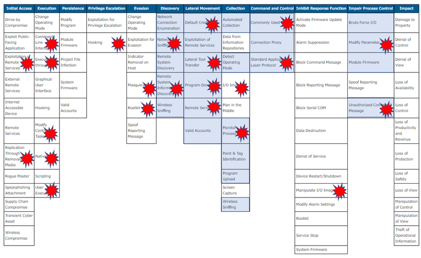

# 🐍 Stuxnet — Overview & ICS Attacks/Detection

Stuxnet is a highly sophisticated piece of malware discovered in 2010 that targeted Siemens Step7/WinCC industrial control systems. It used multiple zero‑day vulnerabilities and stolen digital certificates to spread and to subvert specific PLCs. This repo is meant for historical study, detection, and defensive readiness only.

## ⚠️ Attacks in ICS

* Targeted **Siemens PLCs** controlling centrifuges in Iranian nuclear facilities.
* Used **zero-day Windows vulnerabilities** to gain initial access and propagate via USB/removable media and network shares.
* Manipulated PLC logic to subtly damage equipment while reporting normal operations to SCADA operators.
* Employed stolen **digital certificates** to appear legitimate and evade detection.

### Known CVEs (public, for defensive tracking)

* **CVE-2010-2568** — Windows Shell shortcut (.LNK/.PIF) remote code execution vulnerability.
* **CVE-2010-2729** — Windows Print Spooler remote code execution / impersonation.
* **CVE-2010-2743** — Win32k keyboard-layout handler privilege escalation.
* **CVE-2010-2772** — Siemens SIMATIC WinCC / Step7 authentication/credential issue.
## mitre attack matrix ics

---

---

## 🛡️ Detection & Defensive Measures

* **Patch Management**: Ensure Windows and ICS engineering stations are up-to-date.
* **USB/Media Controls**: Harden removable media usage and monitor for unusual devices.
* **SCADA Monitoring**: Watch for abnormal PLC instructions, sensor feedback inconsistencies, and unplanned logic changes.
* **File Integrity & IOCs**: Monitor engineering workstations for modified Step7 projects, suspicious binaries, or known hashes from vendor advisories.
* **Network Segmentation**: Keep ICS networks isolated from IT networks; monitor traffic for unusual patterns.

## 📚 References (examples of sources to read)

* Vendor advisories (Symantec / Microsoft / CERT / ICS‑CERT) and reputable writeups (Kaspersky, Wired, academic papers).
* 

